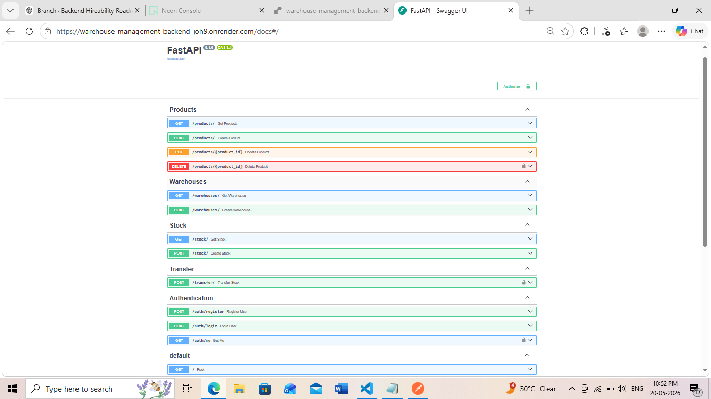
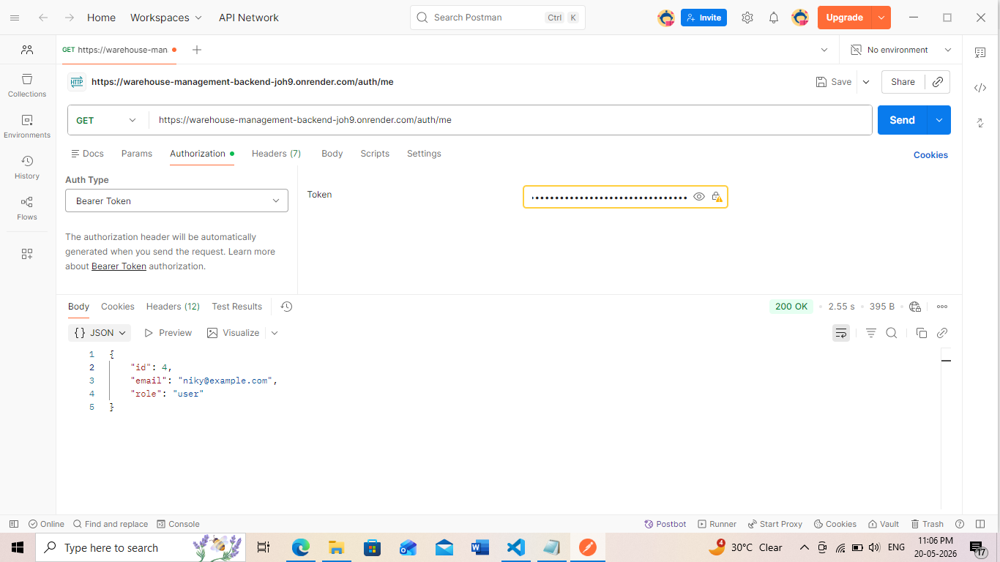
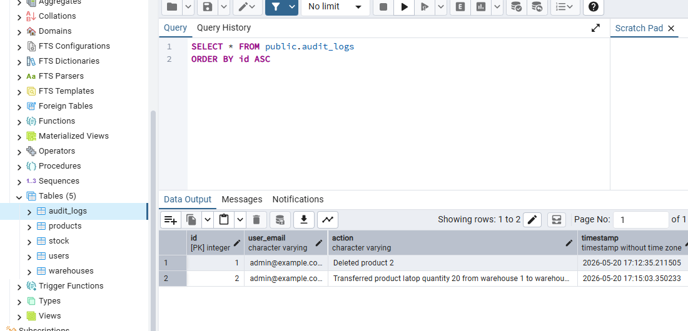

# Warehouse Management Backend

Production-focused warehouse and inventory management backend built using FastAPI and PostgreSQL.

## Live API

- Deployed API: https://warehouse-management-backend-joh9.onrender.com
- Swagger Docs: https://warehouse-management-backend-joh9.onrender.com/docs

---

## Features

- JWT Authentication
- Role-Based Access Control (RBAC)
- Product Management
- Warehouse Management
- Inventory Tracking
- Stock Transfer System
- Audit Logs
- Soft Delete Support
- Pagination & Filtering
- Dockerized Deployment

---

## Tech Stack

- FastAPI
- PostgreSQL
- SQLAlchemy
- Pydantic
- Docker
- Render
- Neon PostgreSQL
- JWT Authentication

---

## API Preview

### Swagger Documentation



---

### Protected Route Authentication



---

### Audit Logs



---

## Project Structure

```bash
app/
├── api/
├── core/
├── db/
├── models/
├── schemas/
├── services/
```

---

## Run Locally

### Clone Repository

```bash
git clone https://github.com/bhandari-nikita/warehouse-management-backend.git
```

### Create Virtual Environment

```bash
python -m venv venv
```

### Activate Virtual Environment (Windows)

```bash
venv\Scripts\activate
```

### Install Dependencies

```bash
pip install -r requirements.txt
```

### Run Development Server

```bash
uvicorn app.main:app --reload
```

---

## Docker Setup

### Build Docker Image

```bash
docker build -t warehouse-backend .
```

### Run Docker Container

```bash
docker run -p 8000:8000 warehouse-backend
```

---

## Environment Variables

Create a `.env` file:

```env
DATABASE_URL=your_database_url

SECRET_KEY=your_secret_key

ALGORITHM=HS256

ACCESS_TOKEN_EXPIRE_HOURS=1
```

---

## Deployment

- Backend deployed on Render
- PostgreSQL hosted on Neon

---

## Future Improvements

- Redis Caching
- Background Tasks with Celery
- Automated Testing with Pytest
- CI/CD with GitHub Actions
- Advanced Analytics & Reporting

---

## Author

Nikita Bhandari